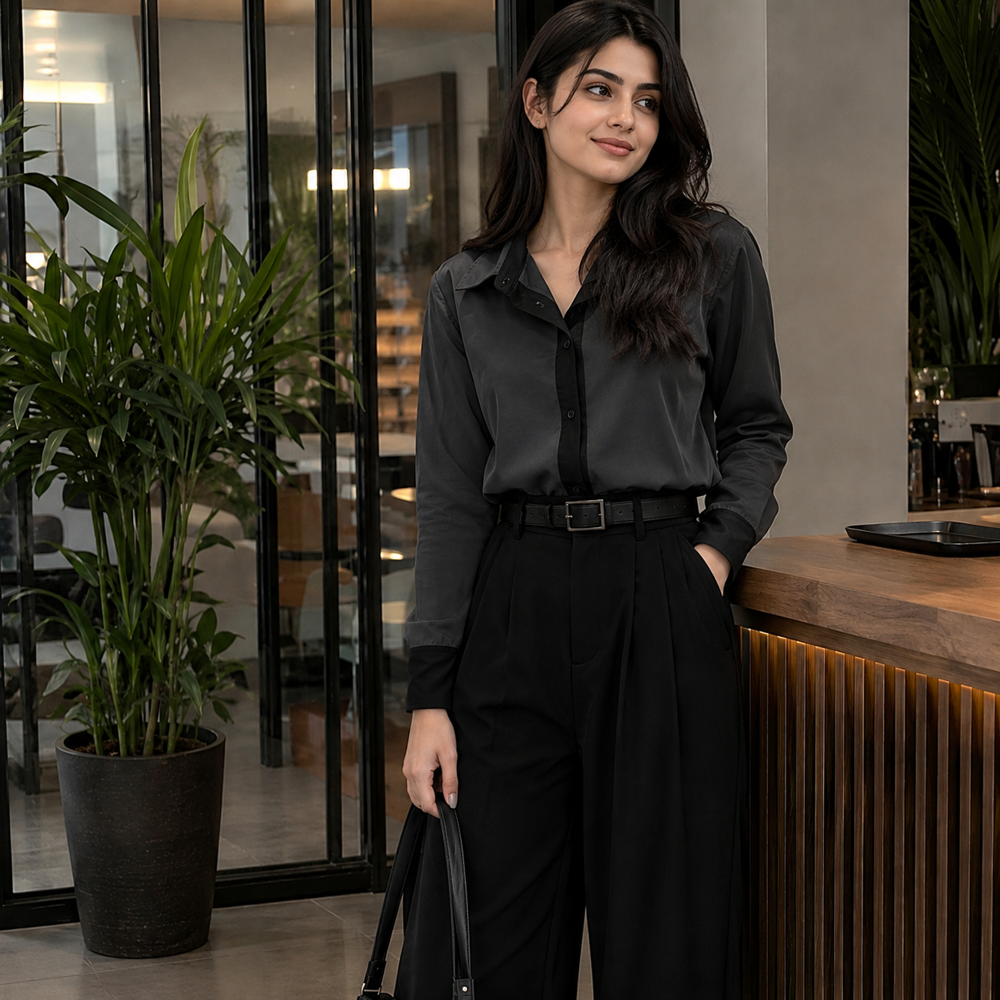

# maha-bouni
 the one and only bouni 4feet girl MAHA
<!DOCTYPE html>
<html lang="en">
<head>
<meta charset="UTF-8">
<meta name="viewport" content="width=device-width, initial-scale=1.0">
<title>MAHA bouni 4 feet</title>

</head>
<body>

<header>
    MAHA bouni 4 feet
</header>

    

        <h2>About Maha 😆</h2>

        

            Maha is only 4 feet tall, but her confidence is 8 feet high! 😂  

            People say when she plays hide and seek, she doesn't even need to hide because she's already below everyone's eye level. 😆  

            Kabhi kabhi log usay dekh kar kehte hain, "Aray bachi idhar kaise aa gayi?" aur phir pata chalta hai ke woh sab se bari hai. 😂  

            Shelves uske liye Everest hain aur stool uska best friend hai.  

            Group photo mein uski permanent VIP seat front row mein hoti hai, warna woh nazar hi nahi aati. 😅  

            Kabhi kabhi doorbell tak pohanchne ke liye usay motivation speech chahiye hoti hai.  

            Uski height choti ho sakti hai, lekin uski awaz aur attitude full-size edition hain. 😎  

            Agar confidence ki height hoti, to Maha sab se lambi hoti.  

            Choti height ka matlab sirf itna hai ke usay zyada hawa nahi lagti. 🤣  

            Mazaq apni jagah, har insan apni personality aur confidence se pehchana jata hai, aur wohi sab se important baat hai. ❤️
        

    

    

        <h3>Instagram 💖</h3>

        

        
Click the picture to visit the Instagram profile 📸

    

<footer>
    © 2026 MAHA bouni 4 feet
</footer>

</body>
</html>
