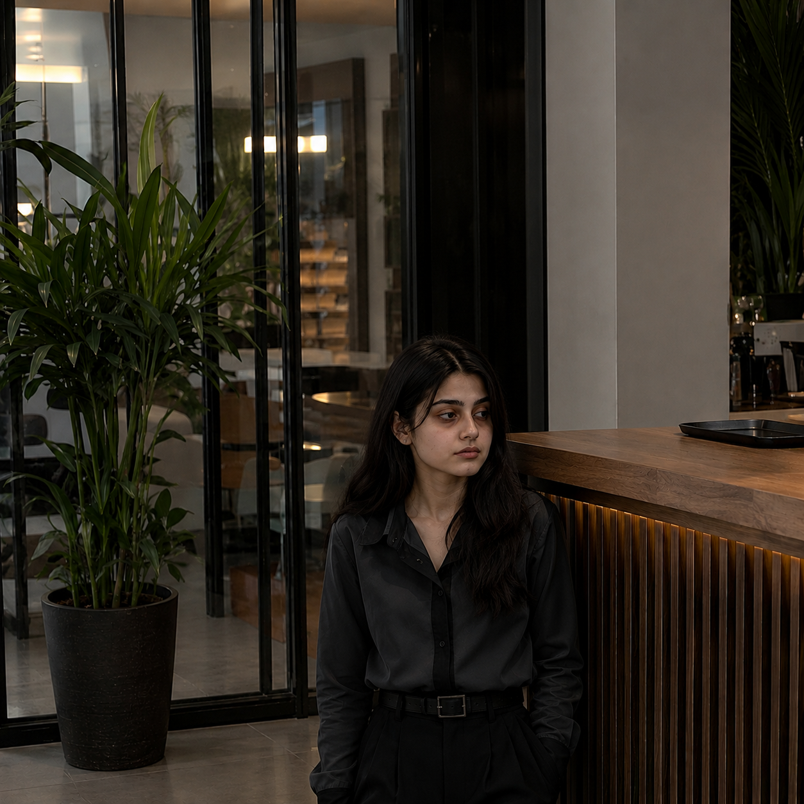

# maha-bouni
 the one and only bouni 4feet girl MAHA
<!DOCTYPE html>
<html lang="en">
<head>
<meta charset="UTF-8">
<meta name="viewport" content="width=device-width, initial-scale=1.0">
<title>Maha</title>

</head>

<body>

<header>
    Welcome to Maha's Page 💖
</header>

<h2>About</h2>

Maha is only 4 feet tall, but her confidence is 8 feet high! 😂  
People say when she plays hide and seek, she doesn't even need to hide because she's already below everyone's eye level. 😆  
Kabhi kabhi log usay dekh kar kehte hain, "Aray bachi idhar kaise aa gayi?" aur phir pata chalta hai ke woh sab se bari hai. 😂  
Shelves uske liye Everest hain aur stool uska best friend hai.  
Group photo mein uski permanent VIP seat front row mein hoti hai, warna woh nazar hi nahi aati. 😅  
Kabhi kabhi doorbell tak pohanchne ke liye usay motivation speech chahiye hoti hai.  
Uski height choti ho sakti hai, lekin uski awaz aur attitude full-size edition hain. 😎  
Agar confidence ki height hoti, to Maha sab se lambi hoti.  
Choti height ka matlab sirf itna hai ke usay zyada hawa nahi lagti. 🤣  
Mazaq apni jagah, har insan apni personality aur confidence se pehchana jata hai, aur wohi sab se important baat hai. ❤️

<h3>Instagram 💖</h3>

Tap the picture to visit the profile 📸

<footer>
Made with ❤️ using HTML & CSS
</footer>

</body>
</html>
